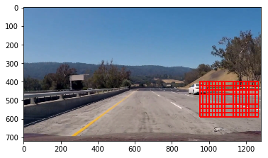

## Project - Vehicle Detection and Tracking

---
## Overview
The goal of this project is to write a software pipeline to implement a  software pipeline to detect vehicles in a video.

  

Watch the full size video [here](https://youtu.be/_RW71oyRJq8).

My project includes the following files:  
`test.ipynb` includes the codes for vehicle detection
`README.md` includes the documentaion of this project
`docs/` includes all the generated images

### Histogram of Oriented Gradients
The first step of this project is to extract the HOG features in the training data and then use them to train the linear SVM. Here the sample images of the training data.

  

  
My initial approach was to use channel 0 in the feature extraction and it gave the accuracy of 0.9838. After suggestion I used all the channels to extract the data and indeed it improve the accuracy to 0.9913. 

Another approach I adapted was to use a threshold instead of predict() function from the classifier to reduce the false positive. After trial and error I found out 1.2 is a good value.

### Sliding Window Search
To search the cars in the image I use the sliding window method. This is to reduce the search time and only focus on the region of interest. In each window, I extract the features, scale and feed to the Linear SVM classifier to predict the occurance of the car in that window. If a car is detected it would be added to a list.

To improve the accuracy and reduce the search time, I used a combination of windows. These windows are chosen to cover the front and right side of the road. However, in real life one might also want to add the windows to the left. The sizes of the windows are set to be large at the bottom of the image and set to be small at the center of the image.


```python
windows1 = slide_window(images[0], x_start_stop=[600, 1000], y_start_stop=[400, 500], 
                xy_window=(80, 70), xy_overlap=(0.8, 0.8))
```


```python
windows2 = slide_window(images[0], x_start_stop=[800, 1100], y_start_stop=[420, 600], 
                xy_window=(120, 120), xy_overlap=(0.8, 0.8))
```


```python
windows3 = slide_window(images[0], x_start_stop=[950, None], y_start_stop=[400, 600], 
                xy_window=(180, 120), xy_overlap=(0.9, 0.8))
```



```python
windows4 = slide_window(images[0], x_start_stop=[900, None], y_start_stop=[400, None], 
                xy_window=(200, 250), xy_overlap=(0.8, 0.8))
```


```python
windows = windows1 + windows2 + windows3 + windows4
```


```python
Here are some sample detections.  
```


```python
for image in images:
    image_test = cv2.GaussianBlur(image, (15, 15), 0)
    draw_image = np.copy(image)
    hot_windows = []
    hot_windows += (search_windows(image_test, windows, svc, X_scaler, color_space=color_space, 
                        spatial_size=spatial_size, hist_bins=hist_bins, 
                        orient=orient, pix_per_cell=pix_per_cell, 
                        cell_per_block=cell_per_block, 
                        hog_channel=hog_channel, spatial_feat=spatial_feat, 
                        hist_feat=hist_feat, hog_feat=hog_feat))                       
    window_img = draw_boxes(draw_image, hot_windows, color=(0, 0, 255), thick=6)    
    show_image(window_img)
```


The heat map approach is used to reduce the false positive. By histograming the bounding box of the vehicle and binarizing the heat map with a threshold I successfully reduced the number of false positives. The following picture shows the comparison of detection with and without heatmap.

  
  
  


### Discussion

1. The first problem I have is the different format of the image. The format of cv2 is BGR but the format of the video image is RGB. To avoid misdetection I convert the training image to RGB format.

2. The second problem I have is that the detection is not continous. To fix this issue I increased the queue of the past frames.

3. There are still some false positive and false negative. To improve the performance I should train the classifier with more data.
